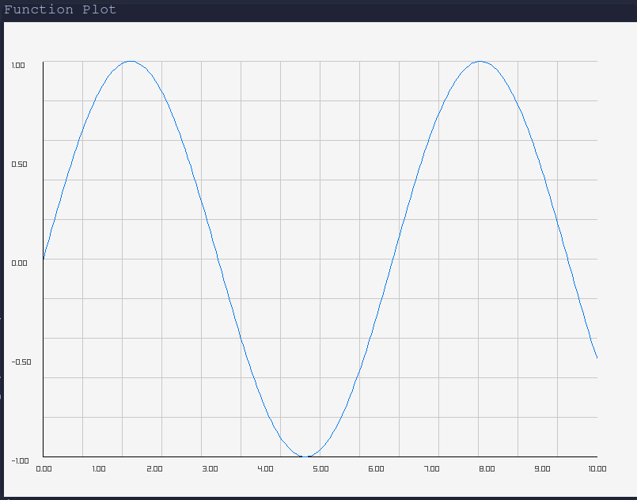
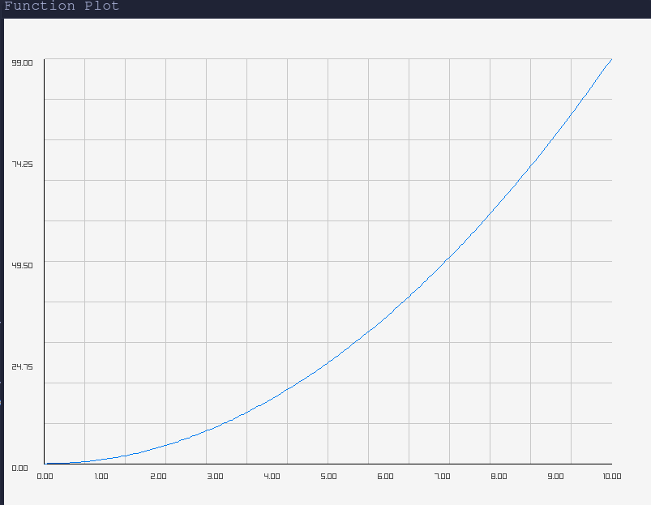

# cgc
C Graphics Calculator
Program written in C that plots a given expression.

## Dependencies
- math 
- raylib

# Usage
```bash
make
./main "1+(2-3)*2" "[-10, 10]"
```

# Examples
sin(x)



x^2


# TODO
- Improve plot with Raylib
- Support for more than one variable
